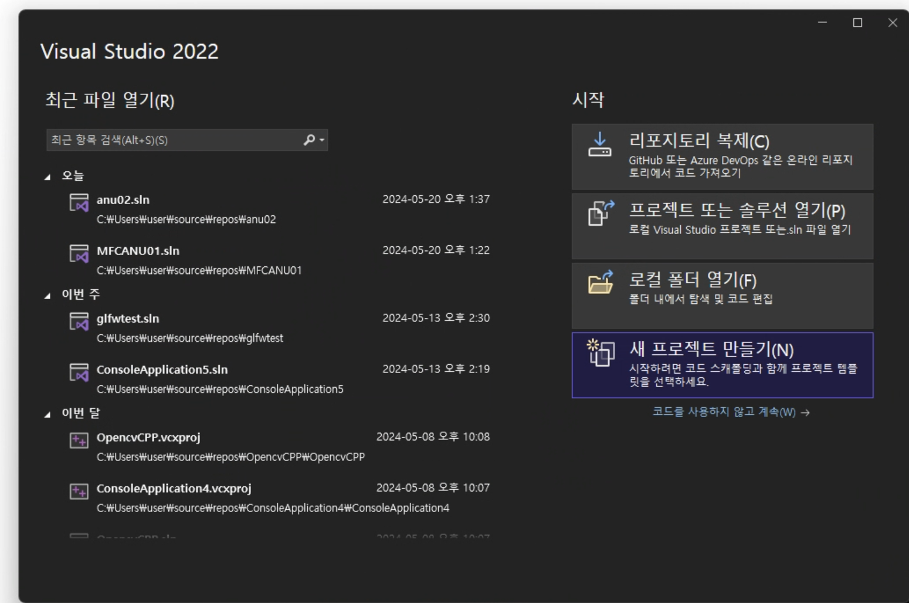

# MFC

> 💡 개발 환경: OS : Windows 11 Home 23H2
> 
> 
> 프로세서 : Intel(R) Core(TM) i7-10700 CPU @ 2.90GHz 2.90 GHz
> 
> RAM : 32.0GB
> 
> IDE: Microsoft Visual Studio Community 2022 (64-bit) - Current버전 17.8.2
> 

1. 새프로젝트 만들기

1. mfc 앱 만들기

1. 프로젝트이름 만들기

1. 대화상자기반 → 마침

1. edit control 3개 딱딱
2. Button 5개 딱딱 넣고 
3. 정렬하기
4. 버튼 더블클릭

1. 버튼 하나하나 만들기
2. a받아오고 b 받아오고 계산하기 → 이때 GetDlgItemInt, SetDlgItemInt를 사용해서 받기 와 보내기
3. IDC_EDIT1 → ID C _ Edit1으로 인식하면 됨 edit객체 id1번
4. 각 번호마다 적용할거 적용한다 ( + - * / %)

1. 예외처리 if문으로 예외처리한다
